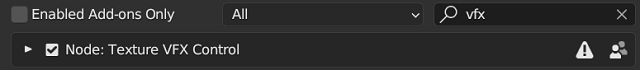
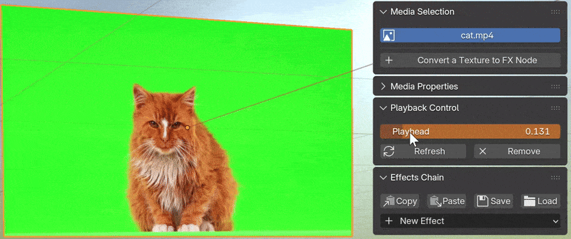
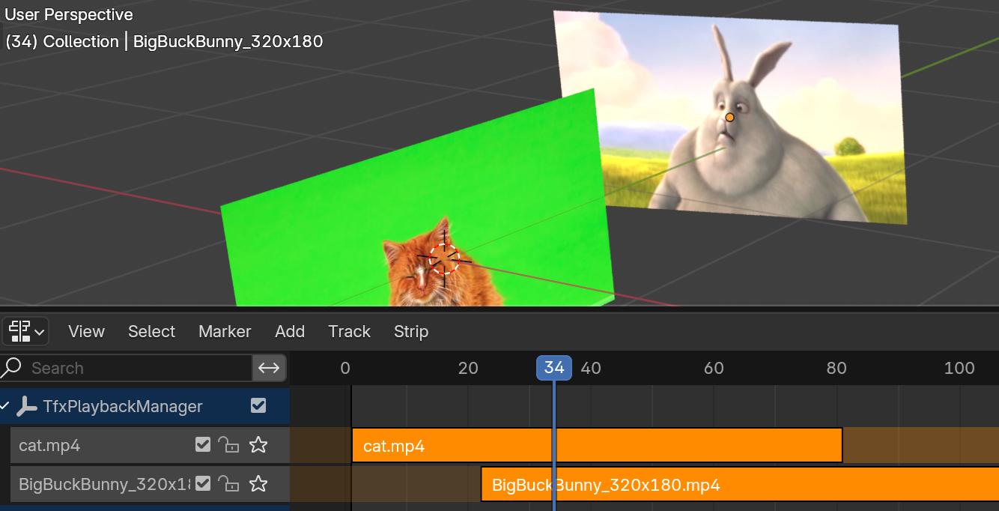
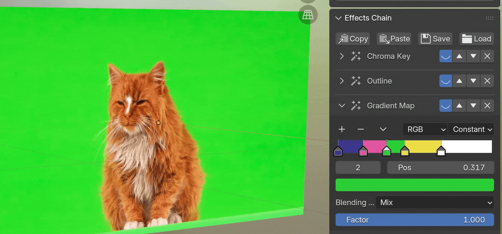

# Texture VFX Control: Blender Add-on

[[English]](README.md) | [[中文]](README_zh.md)

Texture VFX Control is a Blender add-on working on media (videos, images and image sequences) as textures, enabling management of media playback progress and visual effects. The users can have the video editing/composition workflow in the 3D space, therefore facilitating the creation of motion graphics and reels.

Main features:

- **Media Playback Control**
  - Cropping, speed adjustment and reverse playback controlled by keyframes
  - A workspace for arranging multiple video clips
- **Effects Chain Control**
  - Quick application of over 30 popular video effects
  - Non-destructive editing of multiple effects as a chain
  - Save effects as presets and transfer them between objects

## Requirements

Blender 4.2 - 5.0

## Installation

1. Download the `.zip` archive from the [Releases](https://github.com/chsh2/texture_vfx_control/releases) page.
2. Install and enable the add-on from `[Preferences] > [Add-ons]` panel.

## Usage

The add-on can be called from the sidebar of the 3D viewport. A tab named `TexFX` will appear in the sidebar when the active object material contains at least one [Image Texture Node](https://docs.blender.org/manual/en/latest/render/shader_nodes/textures/image.html). The most common way to import media files as textures is through the menu item `[Add] > [Image] > [Mesh Plane]`.

To enable the add-on, click the `[Convert a Texture to FX Node]` button and select the name of the media. After the operation is successful, more panels will appear in the sidebar for subsequent actions.

### Video Playback Control

The playback control can be added to a video or an image sequence through the `[Add Playback Controller]` button. The user can specify the playing speed and the number of loops. There are two modes for video playback management.

#### Local Keyframes

In this mode, a new keyframe channel `tfxPlayhead` is added to the active material, which is also visible in the add-on panel. When this property value is 0, it corresponds to the start of video playback; when it is 1, it corresponds to the end of video playback. The user can make fine-grained control of the video playback through keyframes and F-Curves.

#### Global Manager

In this mode, an object named `TfxPlaybackManager` is created by the add-on, which stores the animation data of all media in a centralized manner. By clicking the `[Open Global Manager]` button, the add-on creates a new workspace, where the user can manage multiple media as action strips in an NLA editor.

### Visual Effects Control

Visual effects can be added to both videos and still images. The button `[Effects Chain] > [New Effect]` at the bottom of the sidebar inserts a new effect to the current media. All existing effects will be displayed in the panel as an effects chain. The user can tune the parameters of each effect, or enable/disable/delete/reorder any effect in the chain.

#### Drivers

Certain effect parameters have an icon button on the side, which adds drivers to the parameter in order to create animations. There are different types of drivers:

- **Location Driver**: The parameter value is determined by the relative location to another object. For example, the user can assign an object as the light source to decide the angle of the drop shadow effect.
- **Temporal Driver**: The parameter value increases with the frame number, so that an animation will be created.
- **Transition In/Out**: For videos with the playback control set up, the transition effects can be bound to the playback control, so that the user does not need to create keyframes manually. 

#### Save/Load Presets

The buttons at the top of the Effects Chain panel allow the user to save the current effects chain as a preset, either to a JSON file or to the clipboard. This preset can then be loaded/pasted to apply the same effects to another object.

## Credits

The shader node groups in this add-on have the following references:
- https://github.com/obsproject/obs-studio/blob/master/plugins/obs-filters/data/chroma_key_filter.effect
- https://godotshaders.com/shader/green-screen-chromakey/
- https://www.shadertoy.com/view/7sscD4
- https://www.shadertoy.com/view/4s2GRR

The following assets are used for demonstration purposes in the documentation:
- https://pixabay.com/videos/cat-pet-green-screen-green-nature-116648/
- [Big Buck Bunny](https://peach.blender.org/)