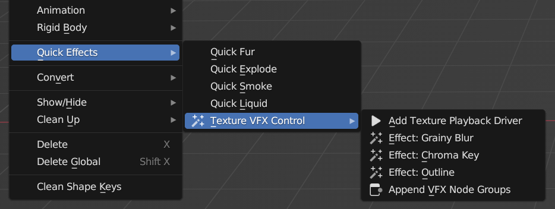
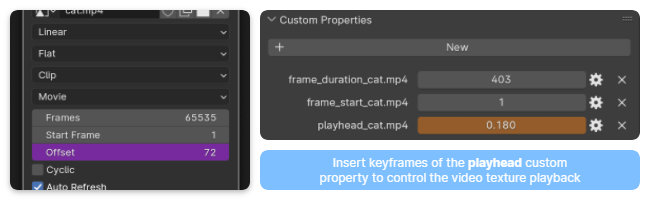
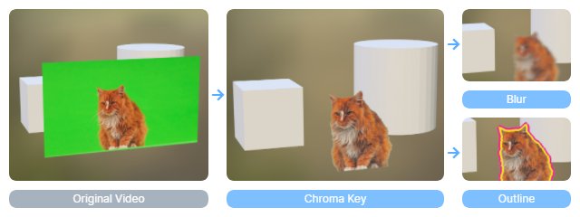

# Texture VFX Control: Blender Add-on

[[English]](README.md) | [[中文]](README_zh.md)

This Blender add-on provides with shader-based effects on image/sequence/movie textures. Users can perform video composition directly in the 3D space without using the compositor or the video sequence editor.

The functionalities of this add-on include:

- Texture Playback Control
  - Speedup/slowdown/offset/reverse of sequence/movie textures controlled by keyframes
- VFX Shaders
  - Blur
  - Chroma Key
  - Outline

## Requirements

Blender 3.3+ or Blender 4.0

## Installation

1. Download the `.zip` archive from the [Releases](https://github.com/chsh2/texture_vfx_control/releases) page.
2. Install and enable the add-on from `[Preferences] > [Add-ons]` panel.

## Usage

It is recommended to use this add-on's operators on images/sequences/movies imported through [Images as Planes](https://docs.blender.org/manual/en/latest/addons/import_export/images_as_planes.html). Select the imported object, and access the add-on through `[Object] > [Quick Effects] > [Texture VFX Control]`.

The add-on can also work with any material containing a [Image Texture](https://docs.blender.org/manual/en/latest/render/shader_nodes/textures/image.html) shader node. If the active material contains more than one image texture, please select one of them in the Shader Editor. The same menu can be found in the Shader Editor `[Add] > [Texture VFX Control]`.

### Playback Control Driver

By executing `[Add Texture Playback Driver]`, a [driver](https://docs.blender.org/manual/en/latest/animation/drivers/introduction.html) will be added to the `Offset` attribute of the video texture. At the same time, a custom property named `playhead_{{video's name}}` can be found in the `Object Properties` panel.

The playback of the video can be controlled by keyframes of the `playhead` property. A value of 0 shows the first frame of the video and a value of 1 shows the last frame. In this way, different effects can be achieved such as offset, speed changes and reverse play.

**[Limitations]** *The frame offset is an attribute of the material. Therefore, all objects with this material will always show the same frame of the video. If you want to show different frames of the same video in multiple objects, you may need to import the video through [Images as Planes](https://docs.blender.org/manual/en/latest/addons/import_export/images_as_planes.html) again, rather than duplicate the object.*

### VFX Shader Node Groups

Menu items `[Effect: *]` adds some common VFXs to the image/movie texture. Multiple effects can be used together. They can also work with the playback driver.

You can also manually set up the VFX shader nodes to achieve more variants of these effects. `[Append VFX Node Groups]` will append all preset node groups from this add-on to the current file.

**[Limitations]** *The outline shader has a complicated setup, including creating 4 new copies of the texture nodes. Please pay attention to the sequence of nodes if you would like to use it along with other shader node groups which are not from this add-on.*

## Credits

The method of Chroma Key comes from [OBS Studio](https://obsproject.com/). Its implementation also refers to a [Godot shader](https://godotshaders.com/shader/green-screen-chromakey/) made by [BlueMoon_Coder](https://godotshaders.com/author/bluemoon_coder/).

The example video used in this document is from [Pixabay](https://pixabay.com/videos/cat-pet-green-screen-green-nature-116648/) made by BoVibol.