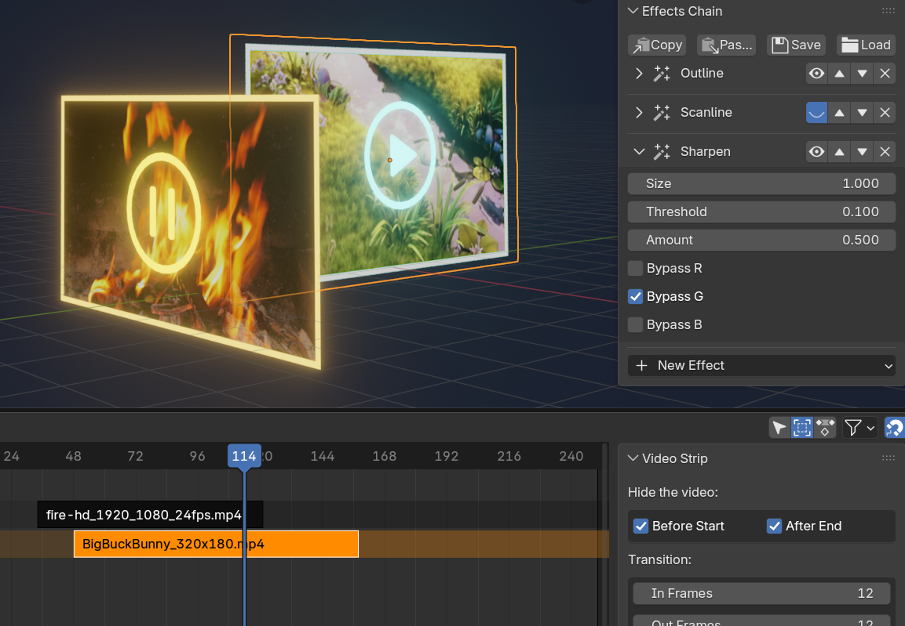

# Texture VFX Control: Blender Add-on

[[English]](README.md) | [[中文]](README_zh.md)

[<📖文档>](https://chsh2.github.io/tfx/) | [<🎥视频演示>](https://www.bilibili.com/video/BV1vwk5BiEgz/)

本Blender插件作用于媒体纹理（图片、图片序列和视频），利用节点组和驱动器来实现媒体的播放进度管理和特效管理。用户在三维空间中仍可按照视频编辑/合成软件的习惯进行操作，从而提高动态图形与视频特效的制作效率。

本插件的主要功能如下：

- **媒体播放管理**
  - 视频剪裁/变速/倒放、利用关键帧控制播放进度
  - 用来排列组织多个视频的管理器界面
- **视频特效管理**
  - 一键应用超过40种常见的视频特效/转场
  - 复数特效的链式管理与非破坏性编辑
  - 保存特效作为预置、为多个物体批量应用特效

## 系统需求

Blender 4.2 ~ 5.1

## 安装步骤

1. [下载](https://github.com/chsh2/texture_vfx_control/releases)`.zip`压缩包。
2. 在`[偏好设置] > [插件]`面板中安装并启用本插件。

## 使用步骤

如果当前物体的材质包含[图像纹理节点](https://docs.blender.org/manual/en/latest/render/shader_nodes/textures/image.html)，3D视图的侧边栏会出现`TexFX`标签，本插件的功能可在该标签页内使用。通常推荐使用Blender内置的`[添加] > [图像] > [网格平面]`菜单项来导入图片或视频。

要启用插件功能，请点击侧边栏中`[Convert a Texture to FX Node]`按钮，并在下拉菜单中选择图像/视频的名称。操作成功后，侧边栏中将出现更多面板，以供进行后续操作。

详细说明请参考[在线文档](https://chsh2.github.io/tfx/)。

## 参考与致谢

特效节点组的实现参考了以下代码：
- https://github.com/obsproject/obs-studio/blob/master/plugins/obs-filters/data/chroma_key_filter.effect
- https://godotshaders.com/shader/green-screen-chromakey/
- https://www.shadertoy.com/view/7sscD4
- https://www.shadertoy.com/view/4s2GRR
- https://www.shadertoy.com/view/ls3cDB

功能演示中使用了以下素材：
- Adrian Hoparda at [pexels.com](https://www.pexels.com/@adrian-hoparda-1684220/)
- BoVibol, fawaz-qureshi at [pixabay.com](https://pixabay.com/)
- Big Buck Bunny from [Blender Foundation](https://peach.blender.org/)
