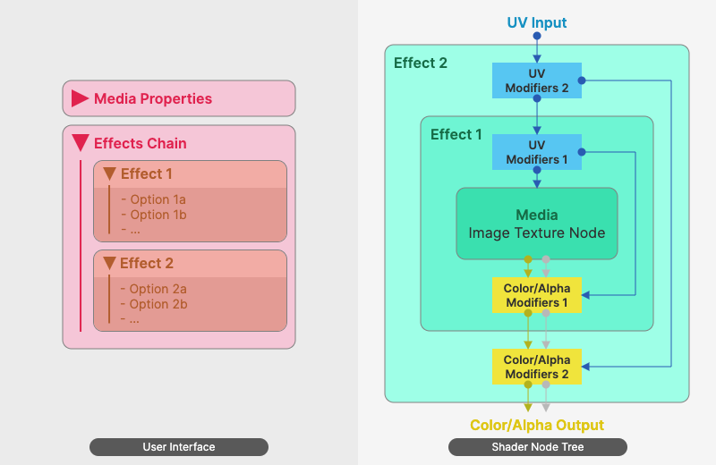

# 设计理念 {.unnumbered}

本章节简要介绍插件的工作原理以及实现方法的选择，以便作为定制化或者二次开发的参考。

## 媒体特效链

本插件附带的特效都是用着色器实现的，每个特效即是一个着色器节点组。为了实现传统的2D视觉特效，并在EEVEE与Cycles渲染下呈现相同的显示效果，节点组的功能：

- **包括**：对作为图像纹理节点的媒体的UV、颜色与透明度值进行数学运算。
- **不包括**：接受3D场景的几何与光照信息、使用BSDF等内置着色器。

虽然节点组的功能较简单，但插件还是选择创建一个新的UI面板以供用户操作，而不是直接提供资产，原因在于下一节提到的节点结构的问题。

### 着色器节点结构

假如为一个媒体插入一系列特效（`[媒体]->[特效1]->[特效2]`），最理想的情况是让节点的排列与该心智模型一致，也就是在图像纹理节点后串联插入代表特效1与特效2的节点组。然而，许多特效涉及同时修改图像纹理节点的UV（属于节点输入）与颜色/透明度（属于节点输出），因此必须将图像纹理节点放在特效节点组的中间位置。当插入多个特效时，实际上形成的是如下图所示的嵌套结构：

此结构除了让用户不易辨识外，也有操作上的难点——

- 如果用户想要更换媒体，需要手动一层层进入多个节点组。
- 想要重排特效的顺序，或在已有的两个特效中间加入另一个特效，都会涉及繁琐且易出错的手动操作。
- 模糊与描边等特效需要多套UV值，这会进一步增加手动操作的难度。

因此，插件提供功能来自动化此类替换操作，并用自定义面板用直观的方式将多个插件的排列呈现给用户。

### 暂未使用的工具/方法

- **闭包**：Blender自5.0版本起引入了[闭包](https://docs.blender.org/manual/en/latest/render/shader_nodes/utilities/closure.html)节点。使用闭包可以对贴图与特效节点进行更好的抽象，有可能做到将多个特效节点组串联排列，从而避免嵌套结构以及大量手动修改的问题。不过由于该概念在Blender中相对较新，且插件需要兼容4.x版本，因此暂不考虑使用闭包来实现特效链。
- **合成器**：虽然本插件的功能从影视制作流程来看更像是后期合成，但却使用了Blender的着色器而不是合成器。这是因为目前Blender的合成器还没有很简单的方法来为场景中的每个物体提供不同的特效链。虽然相关功能已在官方的计划当中，但其实现形式尚不能确定。除此之外，Blender自5.0版本以来活跃地对合成器进行修改，目前不能确定本插件的想法是否与官方思路一致，因此暂时不会涉及合成器。

## 视频播放控制

Blender的图像纹理节点在载入视频时支持设置起始帧与偏移量，在视频播放过程中不断增大/减小偏移量的值就可以实现视频加速/减速。然而，该偏移量属性无法与其它节点互动，只能通过插入关键帧或驱动器的方式来实现动态赋值。另外，把期望的播放速率换算成偏移量也需要进行一定计算。为了简化这个过程，插件自动推算所需的表达式，并将它作为驱动器插入到偏移量属性上，实现直观的播放控制。

### 全局管理器

该组件希望将视频创作中流行的非线性编辑（NLE, Non-linear editing）工作流程引入到同一3D场景的多个视频纹理素材中。对于动画数据，Blender有NLA编辑器，其理念与NLE很相似，因此插件提供了全局管理器来将视频纹理的关键帧数据转换为NLA轨道片段。

然而，与NLE视频编辑不同，在3D场景中，视频素材只是材质中的一个节点，移动它播放进度的关键帧后，物体其它属性的关键帧（如位置、材质属性、可见性，包括特效节点组中的属性）都不会受到影响，这不符合用户直觉。插件的解决方法是捕捉用户的输入，在每次输入后检查是否有NLA轨道片段的位置发生变化，若发生变化则找到NLA片段对应的物体，重新放置它的关键帧。Blender向插件开放的能力有限，并不能捕获全部的用户输入，因此有时会出现需要用户额外点击鼠标才能同步关键帧的情况，此问题目前暂时没有更好的解决方法。
