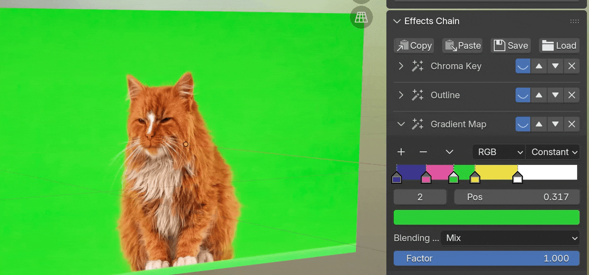
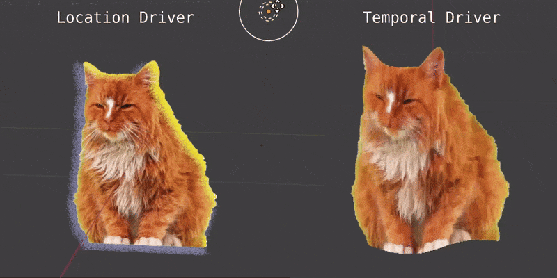

# 特效控制 {.unnumbered}

特效管理功能既适用于视频，也适用于静态图片。使用侧边栏最下方`[Effects Chain] > [New Effect]`按钮为媒体插入一个新特效。该面板将显示出目前已经应用在当前媒体上的所有特效，用户可以调节特效的参数，或者关闭/启用/删除任一特效。

:::{.callout-note}
特效由节点组实现，在EEVEE与Cycles引擎中均可使用。然而，Cycles对每个着色器的节点总数有所限制，如果为同一个媒体插入过多特效，Cycles可能无法正常显示该材质。
:::

## 动画驱动器

部分特效参数的数值旁边显示有图标，插件为这些参数设计了驱动器，以快速实现某些视觉效果。典型的驱动器包括：

- **位置驱动**: 与另一个指定物体的相对位置会影响该参数的值。例如投影效果可以通过指定作为光源的物体来自动决定阴影的方向。
- **时间驱动**: 对于动态的视觉效果，设置该驱动器可以让参数的值随视频的帧数自动增长，因此不需要手动设置关键帧即可实现动画。
- **渐入/渐出**: 对于过渡特效，如果媒体已经使用了上面介绍的播放管理功能，可以将特效的渐入/渐出属性绑定到控制视频播放的关键帧通道上，因此不需要再单独手动设置特效的关键帧。

## 保存预置

特效管理面板提供了一系列按钮用于特效的导入/导出。一个媒体的完整特效链可以作为`JSON`预置文件被保存到文件中，也可以直接复制到其它的媒体上。