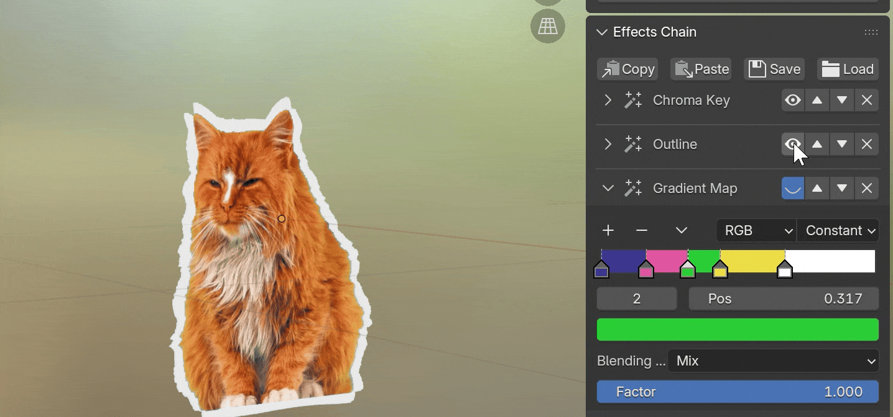

# Visual Effects Control {.unnumbered}

::: {.content-visible when-format="html"}

:::

::: {.content-visible when-format="pdf"}

:::

Visual effects can be added to both videos and still images. The button `[Effects Chain] > [New Effect]` at the bottom of the sidebar inserts a new effect to the current media. All existing effects will be displayed in the panel as an effects chain. The user can tune the parameters of each effect, or enable/disable/delete/reorder any effect in the chain.

:::{.callout-note}
Visual effects are implemented as shader node groups, supported in both EEVEE and Cycles. However, Cycles has a limit on the number of nodes in each shader. Adding too many visual effects to the same media may make it unavailable in Cycles.
:::

## Animation Drivers

::: {.content-visible when-format="html"}

:::

Certain effect parameters have a  button on the side, which adds drivers to the parameter in order to create animations. There are different types of drivers:

- **Location Driver**: The parameter value is determined by the relative location to another object. For example, the user can assign an object as the light source to decide the angle of the drop shadow effect.
- **Temporal Driver**: The parameter value increases with the frame number, so that an animation will be created.
- **Transition In/Out**: For videos with the playback control set up, the transition effects can be bound to the playback control, so that the user does not need to create keyframes manually. 

## Save/Load Presets

The buttons at the top of the Effects Chain panel allow the user to save the current effects chain as a preset, either to a JSON file or to the clipboard. This preset can then be loaded/pasted to apply the same effects to another object.