# 特效一览 {.unnumbered}

## 色彩调节
| 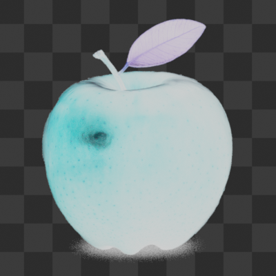 | 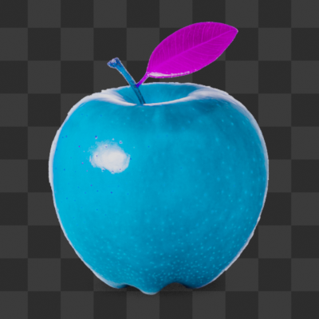 | 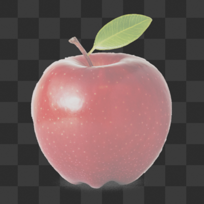 | 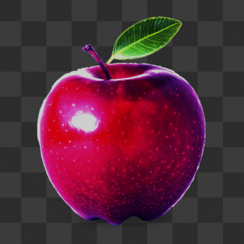 |
| --- | --- | --- | --- |
| Invert | HSV | Brightness/Contrast | RGB Curve |
| 反相 | 色相/饱和度/明度 | 亮度/对比度 | RGB曲线 |

| 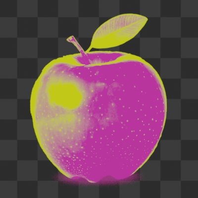 | 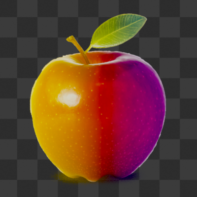 | 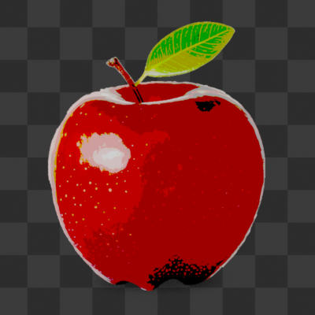 | 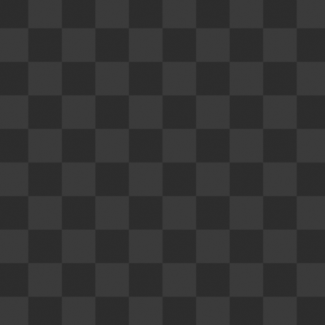 |
| --- | --- | --- | --- |
| Gradient Map | Linear Gradient | Color Quantization |
| 渐变映射 | 线性渐变 | 色彩量化 |

## 透明度相关

| 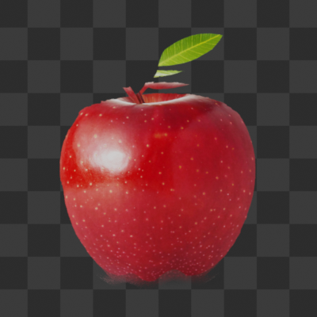 | 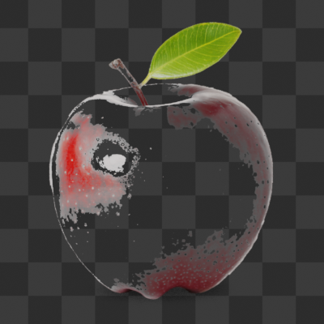 | 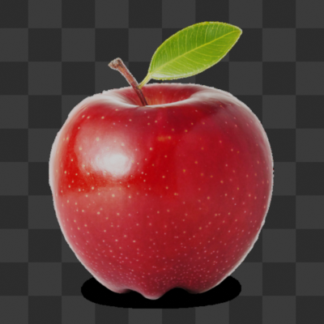 |  |
| --- | --- | --- | --- |
| Alpha Choker | Chroma key | Alpha Clip |
| 透明度收缩 | 色键 | 透明度裁剪 |

| 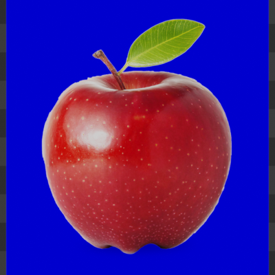 | 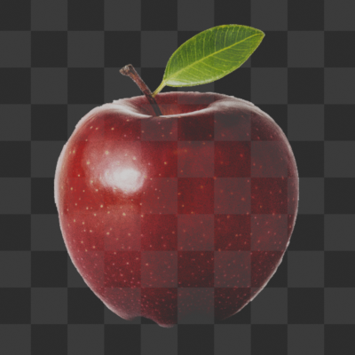 |  |  |
| --- | --- | --- | --- |
| Fill Transparency | Luma Key |  |
| 填充透明部分 | 亮度键 |  |

## 模糊与增强

| 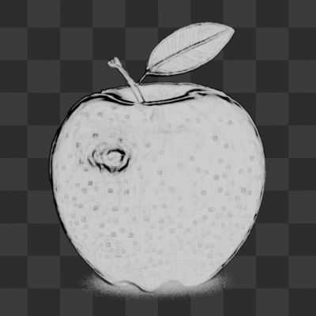 | 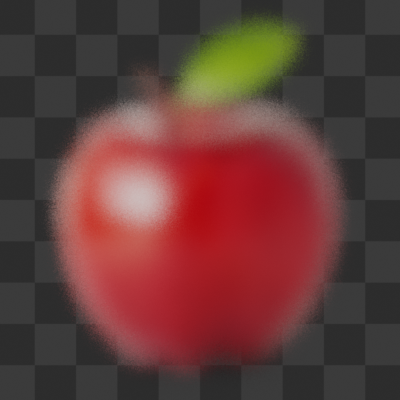 | 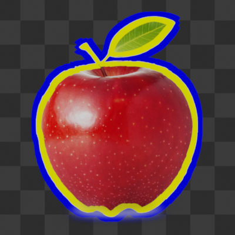 | 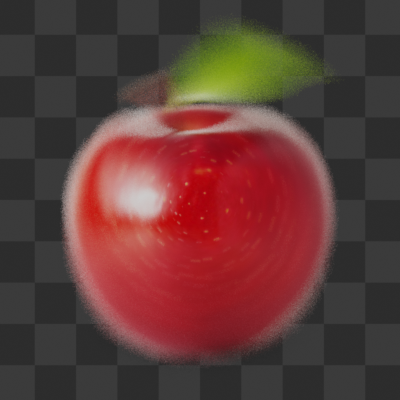 |
| --- | --- | --- | --- |
| Edge Detection | Grainy Blur | Outline | Radial Blur |
| 边缘检测 | 颗粒模糊 | 描边 | 径向模糊 |

| 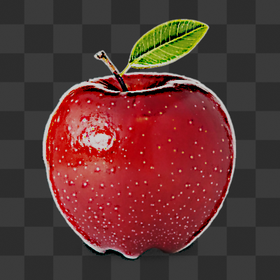 | 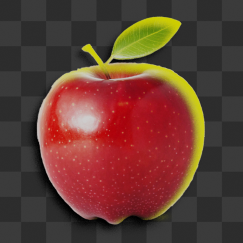 |  |  |
| --- | --- | --- | --- |
| Sharpen | Rim Light/Shadow |  |  |
| 锐化 | 边缘光/投影 |  |  |

## 变形

| 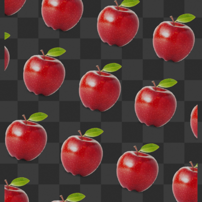 | 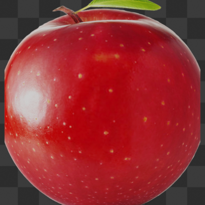 | 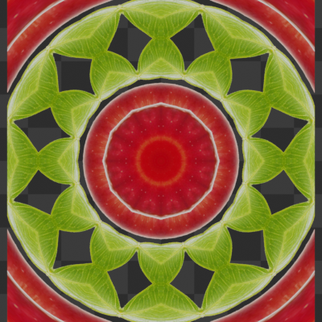 | 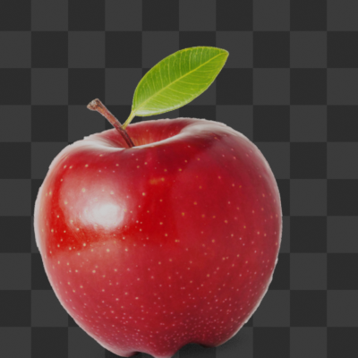 |
| --- | --- | --- | --- |
| Basic Transform | Fisheye | Kaleidoscope | Shake |
| 基本变换 | 鱼眼 | 万花筒 | 镜头晃动 |

| 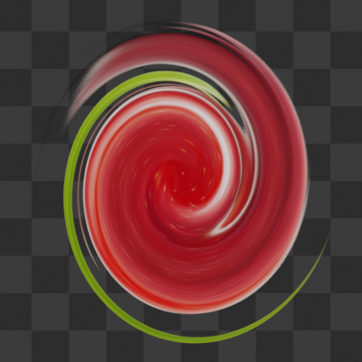 | 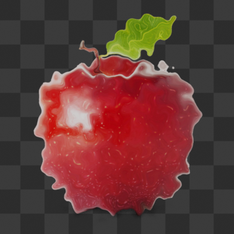 | 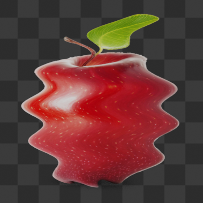 |  |
| --- | --- | --- | --- |
| Swirl | Turbulence | Wave | |
| 旋涡 | 湍流 | 波浪 | |

## 风格化

| 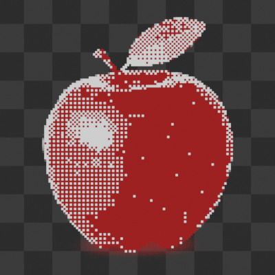 | 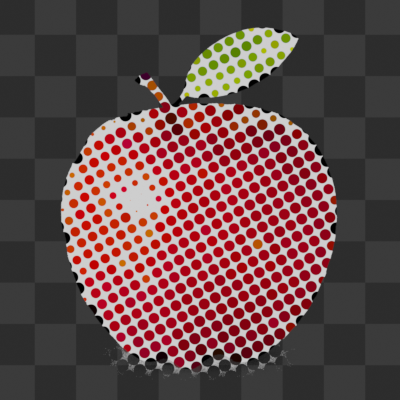 | 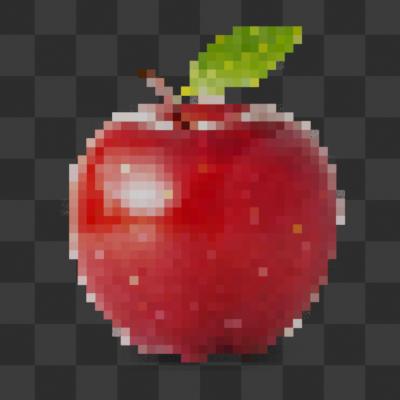 | 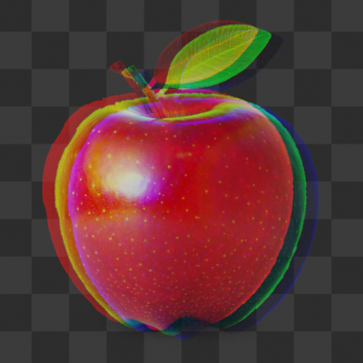 |
| --- | --- | --- | --- |
| Dither | Halftone | Pixelate | RGB Split |
| 抖动 | 半色调 | 像素化 | RGB分离 |

| 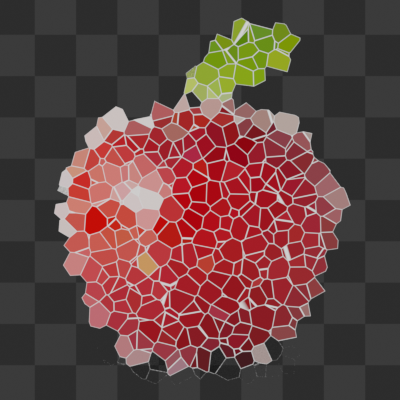 | 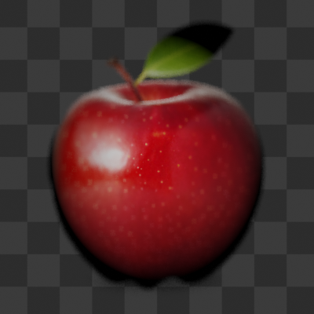 |  |  |
| --- | --- | --- | --- |
| Stained Glass | Vignette | | |
| 彩色玻璃 | 暗角 | | |

## 模拟

| 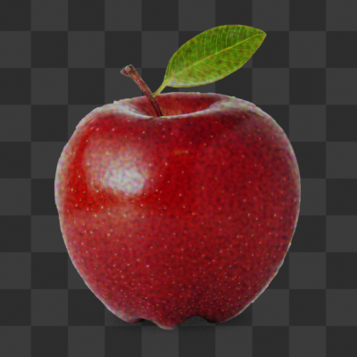 | 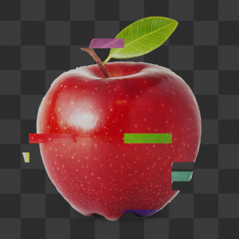 | 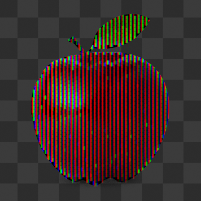 | 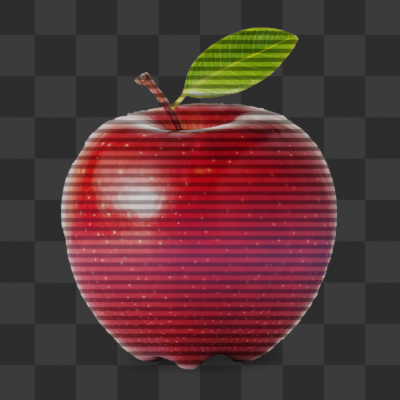 |
| --- | --- | --- | --- |
| Film Grain | Glitch | LCD | Scanline |
| 胶片颗粒 | 故障 | LCD | 扫描线 |

## 转场

| 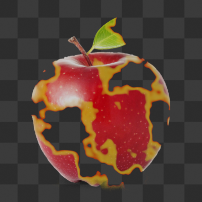 | 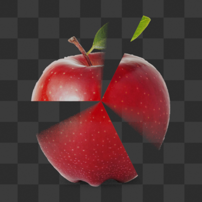 | 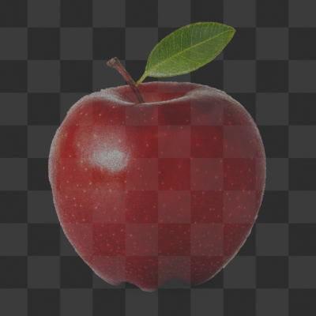 | 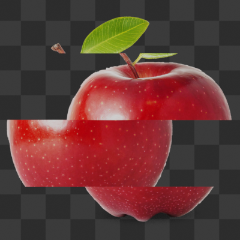 |
| --- | --- | --- | --- |
| Burn | Clock Wipe | Fade | Linear Slide |
| 燃烧 | 时钟擦除 | 淡入淡出 | 线性滑动 |

| 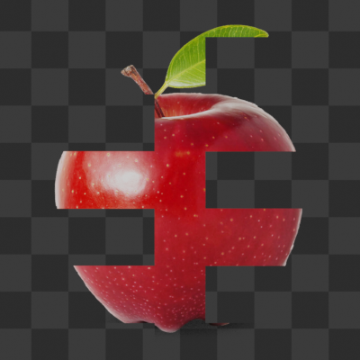 | 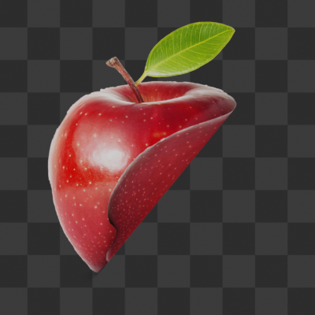 | 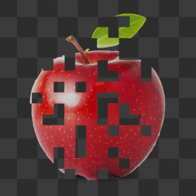 |  |
| --- | --- | --- | --- |
| Linear Wipe | Page Curl | Tile | |
| 线性擦除 | 翻页 | 方格平铺 | |
