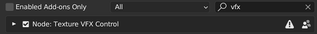

# Get Started {.unnumbered}

## Installation

Texture VFX Control is a legacy Blender add-on. Installation steps:

1. Download the `.zip` archive from the [Releases](https://github.com/chsh2/texture_vfx_control/releases) page.
2. Install and enable the add-on from `[Preferences] > [Add-ons]` panel.

## Basic Usage

The add-on can be called from the sidebar of the 3D viewport. A tab named `TexFX` will appear in the sidebar when the active object material contains at least one [Image Texture Node](https://docs.blender.org/manual/en/latest/render/shader_nodes/textures/image.html). The most common way to import media files as textures is through the menu item `[Add] > [Image] > [Mesh Plane]`.

To enable the add-on, click the `[Convert a Texture to FX Node]` button and select the name of the media. After the operation is successful, more panels will appear in the sidebar for subsequent actions.