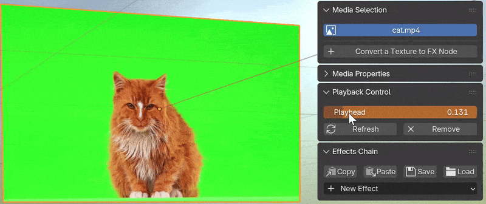
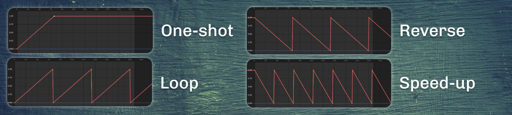

# 播放控制 {.unnumbered}

Blender原生支持将视频文件或图片序列作为材质贴图使用，然而控制播放进度的方式并不直观。使用插件面板中的`[Add Playback Controller]`按钮可以为视频或图片序列生成控制器，从而更加方便地管理视频的播放进度与模式。目前，插件提供两种控制器——关键帧与全局管理器。

## 关键帧模式

当“Controller”选项被设置为`Local Keyframes`时，材质将被添加名为`tfxPlayhead`的关键帧动画通道，该值为0时对应视频播放开始、为1时对应视频播放结束。用户可利用关键帧与曲线实现视频播放进度的精细控制。

### 预设播放模式

在添加控制器的弹出窗口中，可以设置“Playback Rate”、“Loop”、“Reverse”等属性。插件将会自动生成关键帧和曲线，以实现一些常见的播放模式。

### 可见性

“Hide the Video”选项可以将视频在第一帧之前或最后一帧之后隐藏，插件会生成贴图透明度通道的关键帧。如果没有设置此选项，视频在播放范围以外仍然可见，持续显示静止的第一帧或最后一帧。

## 全局管理器模式

如果需要协调同一场景中多个视频的播放进度，推荐将“Controller”选项设置为`Global Manager`来启动全局管理器模式，它会提供一个类似视频编辑器的全新面板。下一个章节将会详细介绍该面板的功能与操作方法。