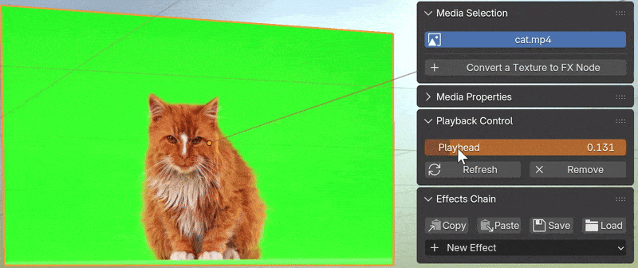

# Playback Control {.unnumbered}

Blender natively supports using video files and image sequences as material textures. However, it is not intuitive to set up common playback modes, such as speed change or reversed playing, to the video. This add-on can generate a playback controller for the video/image sequence via the panel button `[Add Playback Controller]`, making such manipulations easy.

Currently, the add-on provides two styles of playback controllers.

## Local Keyframes

::: {.content-visible when-format="html"}

:::

::: {.content-visible when-format="pdf"}

:::

Selecting `Local Keyframes` in the **Controller** option adds a new keyframe channel `tfxPlayhead` to the active material, which is also visible in the add-on panel. When this property value is 0, it corresponds to the start of video playback; when it is 1, it corresponds to the end of video playback. The user can make fine-grained control of the video playback through keyframes and F-Curves.

### Presets of Playback Modes

During adding the controller, the popup panel allows the user to select several options such as **Playback Rate**, **Loop** and **Reverse**. The add-on can automatically generate keyframes and F-Curves according to these options, which implement some common playback modes.

### Visibility

The option **Hide the Video** generates keyframes of the Alpha channel of the texture, setting the transparency to zero before the first frame and/or after the last frame. When this option is disabled, the video will be visible but static outside the playback range, displaying the first/last frame.

## Global Manager

To orchestrate multiple video clips in the same 3D scene, it is recommended to select `Global Manager` in the **Controller** option. This option provides with a new workspace that allows a video editing workflow. The functionality and usage of the Global Manager will be described in the next chapter.
