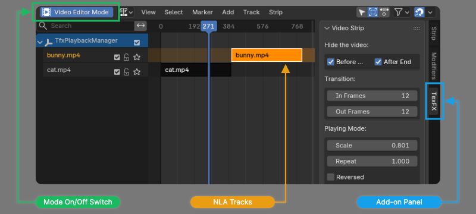

# 全局管理器 {.unnumbered}

全局管理器模式的目的是方便在同一个3D场景中编排多个视频。它旨在提供一个与Blender VSE（视频序列编辑器）相似的界面，用户可以轻易在多个视频之间进行移动、剪辑、变速等操作，视频的可见性和特效关键帧都会随用户的操作自动同步。此模式下，添加新视频也更加方便。

在为视频添加控制器时，如果选择了全局管理器模式，插件面板中就不再会显示出“Playhead”关键帧通道，代替它的是`[Global Manager]`按钮。点击该按钮后，Blender会自动切换到一个新的工作区。

在一个Blender场景中第一次使用全局管理器后，插件会在场景中创建一个名为`TfxPlaybackManager`的新物体。该物体用于保存场景中有关视频播放的动画数据，请勿将其删除。

## 工作区

插件引入了一个名为“Media Playback”的新工作区。该工作区基于Blender自带的[NLA（非线性动画）编辑器](https://docs.blender.org/manual/en/latest/editors/nla/introduction.html)，在左侧添加了一个名为`[Video Editor Mode]`的开关按钮，在右侧添加了名为`TexFX`的侧边栏面板。

在NLA编辑器的时间线中可以看到视频片段。初始状态下所有轨道都是锁定的，不能进行更改，需要点击`[Video Editor Mode]`按钮进入视频编辑器模式后才能开始修改。该状态下，Blender的工作方式与正常的NLA编辑器并不完全相同，请务必阅读以下说明。

:::{.callout-note}
请在侧边栏的`TexFX`标签页中完成对视频片段的所有设置，[不要使用原有的`Strip`和`Modifiers`页面]{.mark}。也请避免在没有运行视频编辑器模式的情况下，手动解锁NLA轨道。
:::

## 视频编辑器模式

启动视频编辑器模式后，相关的NLA轨道会自动解锁，可以拖动NLA片段来调整视频在时间轴中的位置。在时间轴中选择一个视频片段后，3D视图中对应的物体也会被选中，以便进行视频特效或其它属性的设置。

结合`TexFX`侧边栏与NLA编辑器，可以对视频的各种播放属性进行调整。

:::{.callout-note}
切换工作区、切换场景或[执行撤销]{.mark}都会自动结束视频编辑器模式，如果想继续编辑视频，需要手动将该模式再次启动。

另外，在侧边栏面板中修改了视频片段的属性后，有时3D视图中不会自动刷新，[需要在NLA编辑器内单击一次鼠标以令修改生效]{.mark}。
:::

### 改变播放速度

视频的播放速度可以用以下方式调整：

- 调整侧边栏面板中的**Scale**属性，例如`0.5`即是二倍速播放。
- 在时间轴上选中视频片段，然后使用键盘`S`键进行缩放。

### 设置循环播放

在侧边栏面板中更改**Repeat**的值即可让视频循环多次。将**Repeat**值改回`1`以取消循环模式。

### 设置视频定格延长

侧边栏面板中的**Extend**属性通过在视频前后添加静止帧的方式来延长视频。增大**End**的值可以向后延长视频，用最后一帧来填充；减小**Start**的值则是向前延长视频，以第一帧来填充。点击**Reset**按钮可以取消延长模式，消除掉所有的填充帧。

### 裁剪视频

选中一个视频片段后，可以用鼠标在视频片段的左右边缘处拖拽来更改视频的裁剪范围，此时光标将变为刻刀的形状。可以拖拽的范围受到视频原始长度的限制。

:::{.callout-note}
如果已经对视频设置了循环或者延长，拖动该视频片段的边缘时不再会裁剪视频，而是变为修改循环次数/延长程度。必须先取消循环或延长的状态，才能进行裁剪操作。
:::

### 视频可见性

使用侧边栏面板`[Hide the Video]`中的选项来设置视频的可见性，可以控制视频在播放前后是保持显示还是自动隐藏。

### 同步关键帧

默认情况下，当在时间轴上拖动或缩放视频片段时，如果本插件在视频上设置的特效含有关键帧，这些关键帧会随之移动，以与视频播放进度保持同步。

在侧边栏面板`[Editor Setting] > [Synchronize Keyframes]`中，可以设置让视频所属的物体与材质的其它关键帧也随视频拖放而同步移动。请注意，如果物体或材质含有多个视频片段，则不要开启该选项，否则会造成关键帧的混乱。

### 绑定转场特效

如果视频在全局管理器中，单击其转场特效**In**与**Out**属性旁边的图标可以将该特效绑定在视频片段上。之后，可以在侧边栏面板中设置渐入或渐出帧的长度。拖动视频片段时，转场特效也会自动同步到正确的位置。

## 插入新视频

全局管理器中，用户可以在时间线上快速插入新视频。首先选中一个视频片段，然后点击侧边栏面板中的`[Append Media]`按钮并选择一个视频文件，即可将新的视频插入到被选择的视频片段之后。新视频的物体、材质和空间位置都继承被选中的视频。

需注意，如果两个物体的空间位置完全重合，通常会使渲染画面出现错误，因此，插件默认会为新插入的视频设置一个很小的位置偏移量，用户也可自行修改该偏移量的值。
